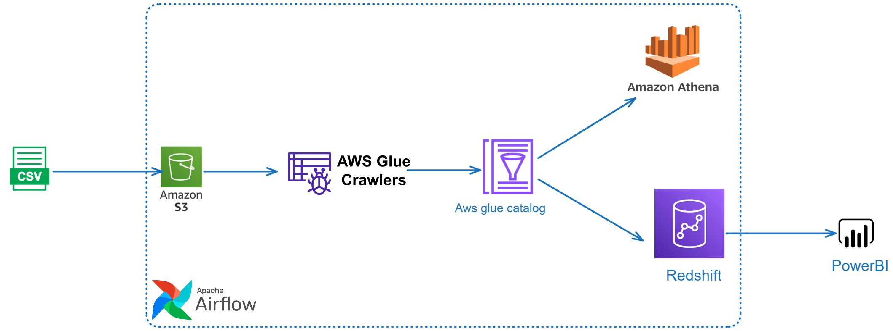

# AWS-ETL Project Overview
This section focuses on developing a complete end-to-end ETL (Extract, Transform, Load) process using AWS services. The workflow will be automated with Apache Airflow and visualized through a Power BI dashboard.

# Architecture
